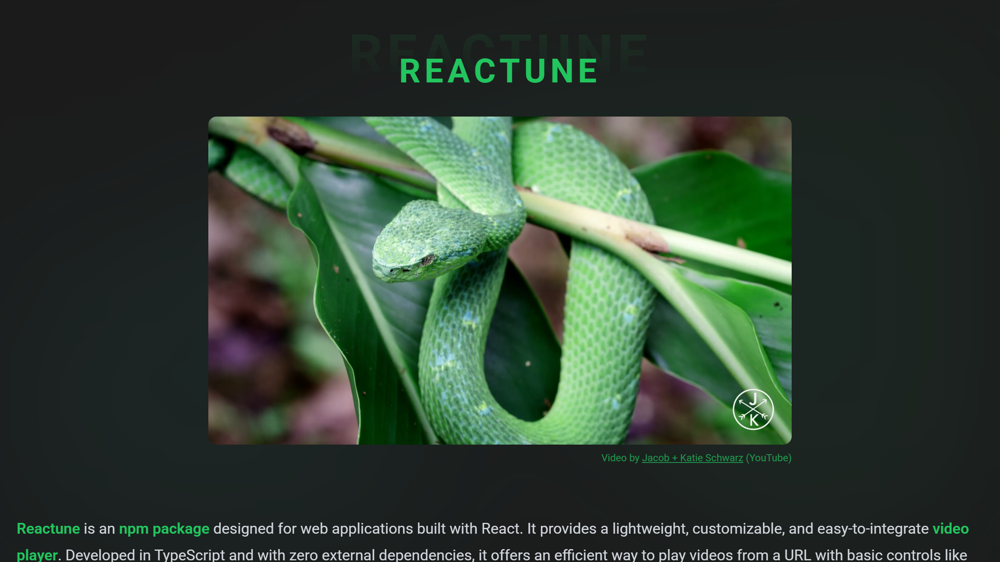

# Reactune Demo



[Live Website](https://salvadorvasqz.github.io/reactune-demo/)

## Overview

This project is a demo built with [Astro](https://astro.build/), integrating React components and styled using [Tailwind CSS](https://tailwindcss.com/). It demonstrates a simple site structure with custom components, layouts, and static assets.

## Project Structure

```
astro.config.mjs         # Astro configuration
package.json             # Project dependencies and scripts
tsconfig.json            # TypeScript configuration
public/                  # Static assets (SVGs, videos)
src/
	components/            # Components
		Reactune.tsx
	layouts/               # Astro layouts
		layout.astro
	pages/                 # Site pages
		404.astro
		doc.md
		index.astro
	styles/                # Global styles
		global.css
```

## Key Features

- **Astro Framework:** Fast static site generation with support for multiple frontend frameworks.
- **React Integration:** Custom React components (e.g., `Reactune.tsx`) used within Astro pages.
- **Tailwind CSS:** Utility-first CSS for rapid UI development.
- **Custom Layouts:** Shared layout (`layout.astro`) for consistent page structure.
- **Static Assets:** SVGs and videos in `public/` for use in pages and components.

## Getting Started

1. **Install dependencies:**
	 ```powershell
	 npm install
	 ```

2. **Run the development server:**
	 ```powershell
	 npm run dev
	 ```

3. **Build for production:**
	 ```powershell
	 npm run build
	 ```

4. **Preview the production build:**
	 ```powershell
	 npm run preview
	 ```

## Usage

- Add new pages in `src/pages/` using `.astro` or Markdown.
- Create or updates components in `src/components/`.
- Customize global styles in `src/styles/global.css`.
- Update layout in `src/layouts/layout.astro`.

